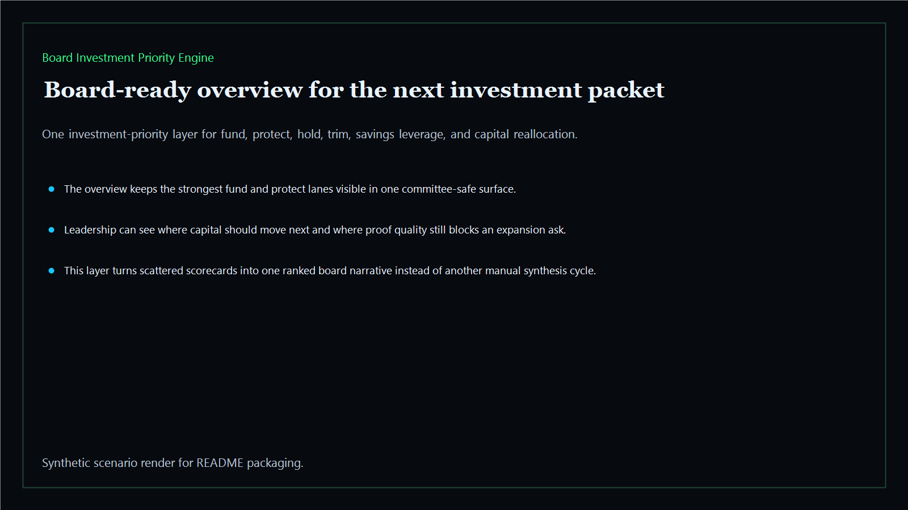
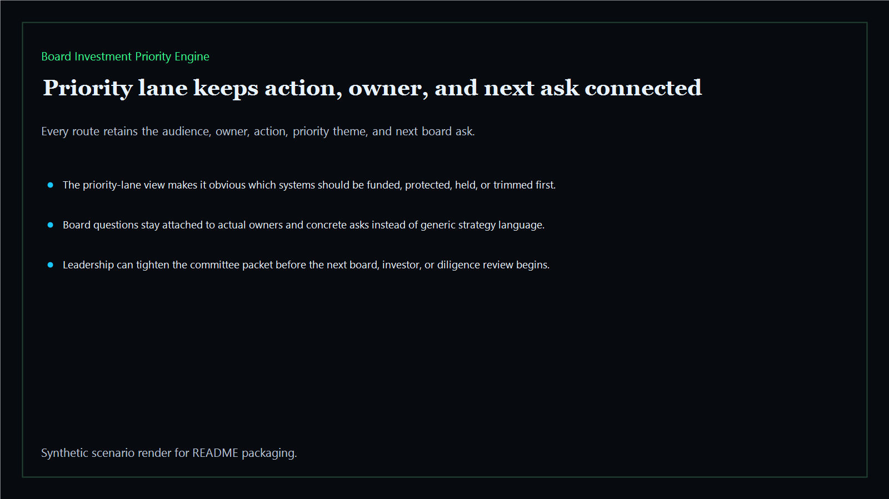
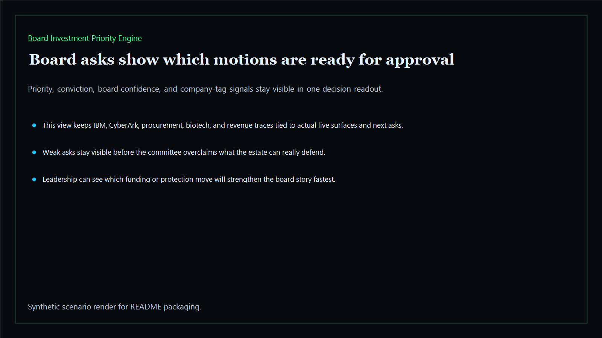
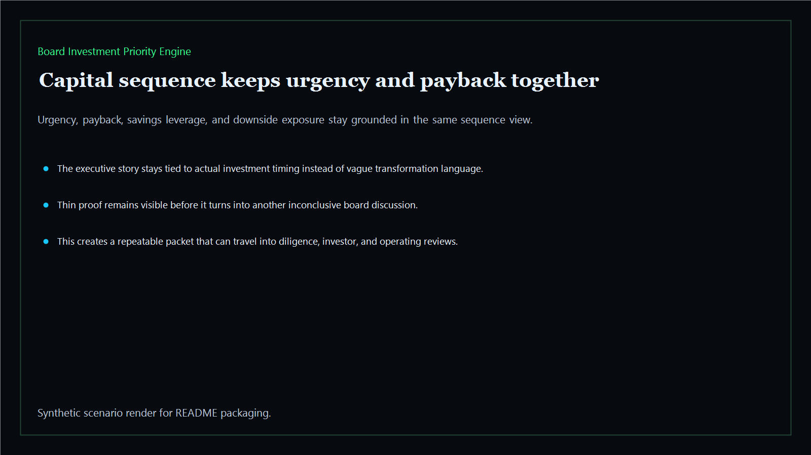

# Board Investment Priority Engine

Board-ready investment-priority layer for ranking what leadership should fund, protect, hold, or trim next across the Kinetic Gain estate.

- Live: `https://priority.kineticgain.com/`
- Repo: `mizcausevic-dev/board-investment-priority-engine`

## Why this matters

Leaders need more than isolated scorecards. They need one investment-priority layer that ranks the next board asks, ties them to evidence, and makes the fund-versus-protect story defensible before the next board or diligence room.

## What it includes

- TypeScript board-priority surface with priority, downside exposure, savings leverage, conviction, payback-window, and board-confidence scoring
- synthetic executive lanes across AI, identity, revenue, FinTech, biotech, procurement, and public-sector readiness
- reusable outputs for fund, protect, hold, and trim decisions, capital-reallocation rollups, and board-ready risk maps
- prerendered static site, JSON payloads, screenshots, and docs

## Routes

- `/`
- `/priority-lane`
- `/board-asks`
- `/capital-sequence`
- `/verification`
- `/docs`

## Local run

```bash
cd board-investment-priority-engine
npm install
npm run verify
npm run prerender
npm run render:assets
```

## CLI

```bash
npx board-investment-priority-engine fixtures/board-investment-priority-engine.json --format summary
npx board-investment-priority-engine fixtures/board-investment-priority-engine-clean.json --format json
```

## Docs

- [Architecture](docs/architecture.md)
- [Origin](docs/ORIGIN.md)
- [Kinetic Gain Embedded](docs/KINETIC_GAIN_EMBEDDED.md)

## Screenshots





